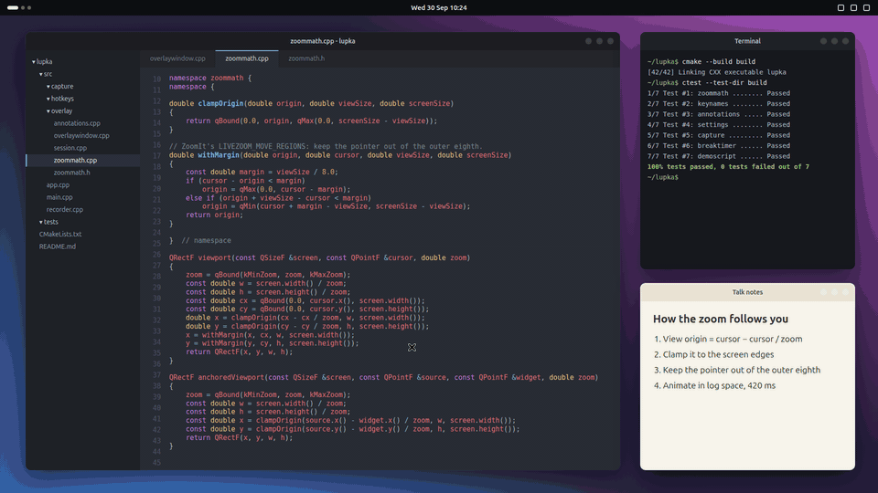
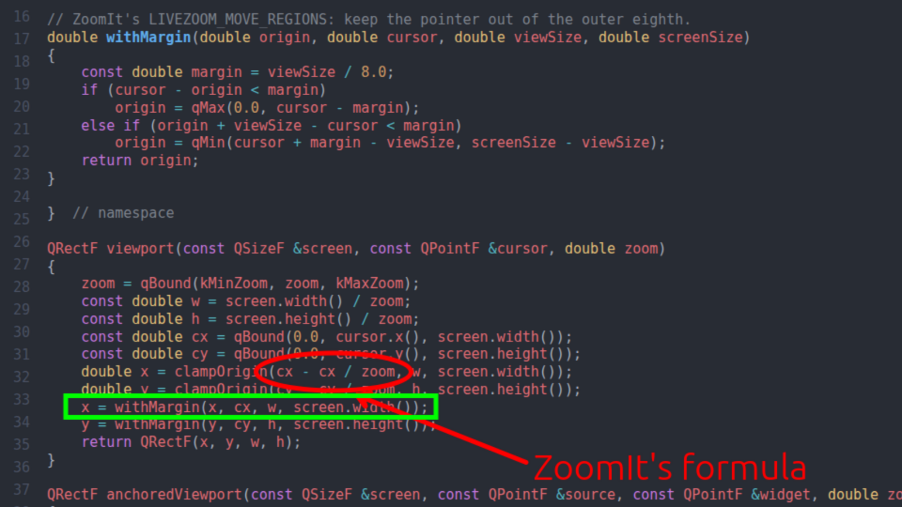
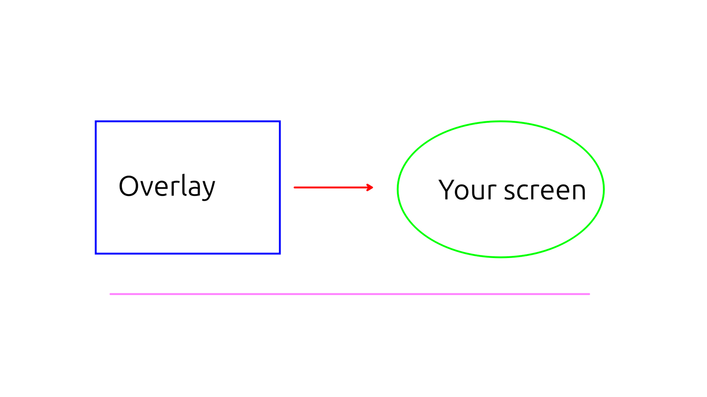
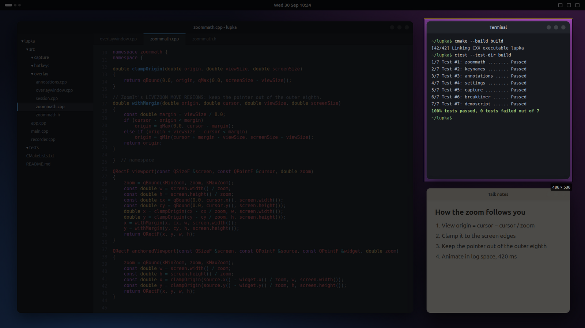
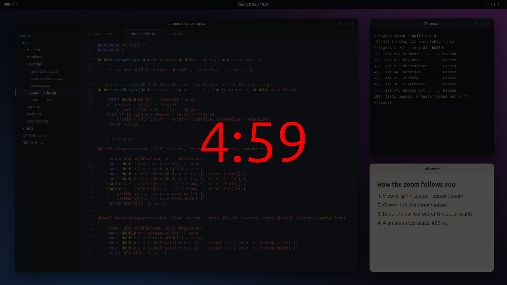
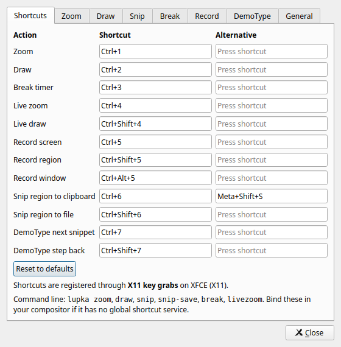

<div align="center">


# Lupka

**Zoom, draw and snip on your screen. ZoomIt, for Linux.**

[](https://github.com/komsky/lupka/actions/workflows/ci.yml)
[](https://github.com/komsky/lupka/releases/latest)
[](LICENSE)


[Install](#install) · [Keys](#keys) · [Desktop support](#desktop-support) · [Contributing](CONTRIBUTING.md) · [Changelog](CHANGELOG.md)



</div>

If you have given a talk or a code review from Windows, you have probably used [ZoomIt](https://learn.microsoft.com/sysinternals/downloads/zoomit): press Ctrl+1, the screen zooms in around the mouse, click and draw an arrow at the line everyone should look at, press Esc and carry on. Lupka ("magnifying glass" in Polish) brings that to the Linux desktop.

It copies ZoomIt closely. The hotkeys, the zoom steps and animation, the drawing keys and the way the view follows the mouse all come from ZoomIt's own source, so your fingers already know how to use it. It runs on GNOME and KDE Plasma under Wayland, on X11 desktops, and on other Wayland compositors with a little setup.

<table>
  <tr>
    <td width="50%"></td>
    <td width="50%"></td>
  </tr>
  <tr>
    <td><b>Zoom and annotate.</b> Ctrl+1, then click to freeze the view and draw. Everything stays put when you zoom or pan again.</td>
    <td><b>Sketch on a whiteboard.</b> Ctrl+2 draws at 1:1; Ctrl+W or Ctrl+K swaps the screen for a white or black board.</td>
  </tr>
  <tr>
    <td></td>
    <td></td>
  </tr>
  <tr>
    <td><b>Snip.</b> Super+Shift+S or Ctrl+6 copies a region to the clipboard. Inside a zoom, it copies what you see.</td>
    <td><b>Take a break.</b> Ctrl+3 puts a countdown on screen, over a colour, the faded desktop or your own picture.</td>
  </tr>
</table>

## What you get

- **Zoom** (Ctrl+1) into a frozen copy of the screen, from 2x up to 256x, and pan by moving the mouse.
- **Draw** on it with eight pen colours, a highlighter, blur, lines, rectangles, ellipses, arrows and text, with 32 steps of undo.
- **Draw without zooming** (Ctrl+2), or over the live desktop (Ctrl+Shift+4).
- **Snip** a region to the clipboard (Ctrl+6 or Super+Shift+S) or to a file (Ctrl+Shift+6).
- **Record** the screen, a region or a window to MP4 or WebM, with system sound (Ctrl+5).
- **Break timer** (Ctrl+3) and **live zoom** through the desktop's own magnifier (Ctrl+4).
- **DemoType** (Ctrl+7) types prepared snippets into any window, for live-coding demos without typos.
- A settings window for every hotkey and option, and a tray icon that shows when you are recording.

## Install

### Ubuntu and Debian

Download the `.deb` from the [latest release](https://github.com/komsky/lupka/releases/latest) and install it:

```sh
sudo apt install ./lupka_*_amd64.deb
```

The package is for Ubuntu 24.04 or newer and Debian 13 (trixie) or newer. If apt prints a note that the download was "performed unsandboxed as root", that is only because the file sits in your home folder; the install is fine.

### Build from source

You need CMake, a C++17 compiler, Qt 6.2 or newer, libxcb, GLib and GStreamer.

<details>
<summary>Ubuntu and Debian packages</summary>

```sh
sudo apt install cmake ninja-build g++ pkg-config dpkg-dev \
    qt6-base-dev qt6-wayland \
    libxcb1-dev libxcb-keysyms1-dev libxcb-xtest0-dev libglib2.0-dev \
    libgstreamer1.0-dev libgstreamer-plugins-base1.0-dev \
    gstreamer1.0-pipewire gstreamer1.0-plugins-good
```
</details>

<details>
<summary>Fedora packages</summary>

```sh
sudo dnf install cmake ninja-build gcc-c++ pkgconf-pkg-config \
    qt6-qtbase-devel qt6-qtwayland libxcb-devel xcb-util-keysyms-devel \
    glib2-devel gstreamer1-devel gstreamer1-plugins-base-devel \
    pipewire-gstreamer gstreamer1-plugins-good
```
</details>

Then build and install:

```sh
git clone https://github.com/komsky/lupka.git && cd lupka
cmake -S . -B build -G Ninja -DCMAKE_BUILD_TYPE=Release
cmake --build build
sudo cmake --install build        # or: (cd build && cpack -G DEB) for a .deb
```

Optional, at run time: `gstreamer1.0-plugins-ugly` for H.264 recordings, `gstreamer1.0-libav` for sound in MP4 files, `gstreamer1.0-x` for recording on X11, `wl-clipboard` for DemoType's paste fallback on Wayland, and `grim` for screen capture on wlroots compositors.

### First start

Open **Lupka** from your application menu once. It goes to the tray, registers its hotkeys and starts again when you log in (you can turn that off in Settings → General).

On GNOME Wayland the first Ctrl+1 asks which screen to share. Press Share once; Lupka keeps that permission and later zooms are instant.

### Uninstall

```sh
lupka --unregister-shortcuts   # removes the hotkeys, the login entry and anything else Lupka wrote
sudo apt remove lupka
```

Your settings stay in `~/.config/lupka/` until you delete that folder.

## Keys

### Hotkeys

| Hotkey | What it does |
|---|---|
| <kbd>Ctrl</kbd>+<kbd>1</kbd> | Zoom. Moving the mouse pans; scroll or Up/Down change the zoom. Click to draw, Esc or right-click to leave. |
| <kbd>Ctrl</kbd>+<kbd>2</kbd> | Draw on the frozen screen at 1:1. Press again to leave. |
| <kbd>Ctrl</kbd>+<kbd>3</kbd> | Break timer. Arrow keys or the wheel change the time. |
| <kbd>Ctrl</kbd>+<kbd>4</kbd> | Live zoom with the desktop's magnifier; Ctrl+Up/Down zoom while it is on. |
| <kbd>Ctrl</kbd>+<kbd>Shift</kbd>+<kbd>4</kbd> | LiveDraw: draw over the live desktop. |
| <kbd>Ctrl</kbd>+<kbd>5</kbd> | Record a whole monitor. Any record hotkey stops the recording. |
| <kbd>Ctrl</kbd>+<kbd>Shift</kbd>+<kbd>5</kbd> | Record a region you drag out. |
| <kbd>Ctrl</kbd>+<kbd>Alt</kbd>+<kbd>5</kbd> | Record a window. |
| <kbd>Ctrl</kbd>+<kbd>6</kbd> or <kbd>Super</kbd>+<kbd>Shift</kbd>+<kbd>S</kbd> | Snip a region to the clipboard. |
| <kbd>Ctrl</kbd>+<kbd>Shift</kbd>+<kbd>6</kbd> | Snip a region to a file. |
| <kbd>Ctrl</kbd>+<kbd>7</kbd> | DemoType: type the next snippet. Esc stops it. |
| <kbd>Ctrl</kbd>+<kbd>Shift</kbd>+<kbd>7</kbd> | DemoType: step back one snippet. |

You can change or turn off any of these in Settings. Like ZoomIt, the defaults take Ctrl+1 to Ctrl+7 away from other applications (browser tab switching, for one) while Lupka runs.

### While drawing

| Key | What it does |
|---|---|
| <kbd>R</kbd> <kbd>G</kbd> <kbd>B</kbd> <kbd>O</kbd> <kbd>Y</kbd> <kbd>P</kbd> <kbd>W</kbd> <kbd>K</kbd> | Red, green, blue, orange, yellow, pink, white or black pen |
| <kbd>Shift</kbd> + a colour | Highlighter in that colour |
| <kbd>X</kbd> / <kbd>Shift</kbd>+<kbd>X</kbd> | Blur / strong blur |
| hold <kbd>Shift</kbd> as you start to drag | Straight line |
| hold <kbd>Ctrl</kbd> | Rectangle |
| hold <kbd>Tab</kbd> | Ellipse |
| hold <kbd>Ctrl</kbd>+<kbd>Shift</kbd> | Arrow, with the head where you started |
| <kbd>Ctrl</kbd>+scroll, <kbd>Ctrl</kbd>+<kbd>Up</kbd>/<kbd>Down</kbd> | Pen width |
| <kbd>T</kbd> / <kbd>Shift</kbd>+<kbd>T</kbd> | Type text, left or right aligned; scroll to resize, Esc to finish |
| <kbd>E</kbd> | Erase everything |
| <kbd>Ctrl</kbd>+<kbd>Z</kbd> | Undo |
| <kbd>Ctrl</kbd>+<kbd>W</kbd> / <kbd>Ctrl</kbd>+<kbd>K</kbd> | Whiteboard / blackboard |
| <kbd>Space</kbd> | Centre the pointer (X11 only) |
| <kbd>Ctrl</kbd>+<kbd>C</kbd> / <kbd>Ctrl</kbd>+<kbd>S</kbd> | Copy / save the view (the save dialog offers zoomed or actual size, PNG or JPEG) |
| <kbd>Ctrl</kbd>+<kbd>Shift</kbd>+<kbd>C</kbd> / <kbd>Ctrl</kbd>+<kbd>Shift</kbd>+<kbd>S</kbd> | Drag out a region, then copy / save it |
| right-click | Stop drawing and pan again |
| <kbd>Esc</kbd> | Close |

LiveDraw has the pens, shapes, text, erase and undo, but no highlighter, blur, boards or zoom, and right-click closes it.

### DemoType

Point Settings → DemoType at a text file in ZoomIt's format: snippets separated by `[end]`, with `[enter]`, `[up]`, `[down]`, `[left]`, `[right]` and `[pause:n]` where you need them, and `[paste]` ... `[/paste]` around text that should be pasted rather than typed. Each Ctrl+7 types the next snippet into the focused window. On Wayland the desktop asks once for permission to type.

### Recording

Recordings go to `~/Videos` (you can change that) as MP4 when an H.264 encoder is installed, otherwise WebM. Tick "Record system sound" to include audio; MP4 files need `gstreamer1.0-libav` for the sound track. On Wayland the desktop asks which screen or window to record and shows its screen-sharing indicator while you record.

## Desktop support

| | GNOME (Wayland) | KDE Plasma (Wayland) | X11 desktops | Sway, Hyprland and other wlroots (untested) |
|---|:-:|:-:|:-:|:-:|
| Zoom, draw, snip | Yes | Yes | Yes | Should work, with `grim` |
| Global hotkeys | Yes | Yes | Yes | Bind `lupka zoom` etc. yourself, or the GlobalShortcuts portal |
| Recording | Yes | Yes | Yes | Should work, through the ScreenCast portal |
| Live zoom | Yes | Yes | GNOME and KDE only | No |
| DemoType | Yes | Yes | Yes | Only where the portal offers RemoteDesktop |
| Tested by the test suites | GNOME 46 and 50 | Plasma 6.7, one and two monitors, HiDPI | Xvfb, with and without mutter | Not yet |

<details>
<summary>How Lupka works on each desktop</summary>

**GNOME (Wayland).** The hotkeys are GNOME custom shortcuts, so you will find them in Settings → Keyboard → Custom Shortcuts. The screen image comes from a ScreenCast portal session: the first zoom asks which screen to share, and after that there is no dialog and no flash, only a brief screen-sharing icon in the top bar. Without the ScreenCast portal, Lupka falls back to the Screenshot portal, which flashes and plays the shutter sound.

**KDE Plasma (Wayland).** The hotkeys go through KDE's global shortcuts (System Settings → Shortcuts → Lupka). Captures use KWin's screenshot interface, with no dialog. KWin only allows that for programs with an installed desktop file, so if none points at the running binary (a build run from its source folder, say), Lupka writes one to `~/.local/share/applications/`.

**X11.** The screen is read from the X server and nothing asks for permission. GNOME and KDE still use their own shortcut services; on other X11 desktops Lupka grabs the keys itself.

**Other Wayland compositors.** Hotkeys go through the GlobalShortcuts portal where there is one. Otherwise bind `lupka zoom`, `lupka draw`, `lupka snip` and friends to keys in your compositor's config. Screen capture uses `grim` if it is installed, then the Screenshot portal.
</details>

## Settings and command line



Open Settings from the tray icon or with `lupka settings`. Everything is stored in `~/.config/lupka/lupka.ini`.

Every hotkey is also a command, which is handy for scripts and for compositors without a shortcut service:

```
lupka zoom | draw | livedraw | snip | snip-save
lupka break | livezoom
lupka record | record-region | record-window
lupka demotype | demotype-back
lupka settings | quit
lupka --background | --unregister-shortcuts | --version | --help
```

<br clear="right">

## Differences from ZoomIt

Not there yet: panorama screenshots, DemoMirror, the webcam overlay, the recording trim editor, DemoType's user-driven mode (where each key you press types the next character of the snippet) and OCR snip. Pull requests for any of these are welcome.

A few things differ on purpose. Ctrl+2 closes the draw overlay when you press it again. Super+Shift+S is bound to Snip by default, as it is on Windows. On Wayland an application cannot move the pointer, so Space (centre the pointer) only works on X11.

## Contributing

Bug reports, testing on desktops we have not covered, and pull requests are all very welcome. [CONTRIBUTING.md](CONTRIBUTING.md) explains how to build Lupka, run the unit tests and the end-to-end suites (X11 in Xvfb, nested GNOME, and KDE Plasma and GNOME 50 in containers), and what a good pull request looks like. For questions and ideas, use [Discussions](https://github.com/komsky/lupka/discussions). Security problems go through the private process in [SECURITY.md](SECURITY.md).

Everyone taking part is expected to follow the [Code of Conduct](CODE_OF_CONDUCT.md).

## Acknowledgements

ZoomIt is a [Sysinternals](https://learn.microsoft.com/sysinternals/) tool by Mark Russinovich, and its source code is published under the MIT licence as part of [Microsoft PowerToys](https://github.com/microsoft/PowerToys). Lupka is a separate, independent project: it reimplements ZoomIt's behaviour for Linux, using that source as a reference, and is not affiliated with or endorsed by Microsoft.

The research that shaped Lupka, including a survey of existing Linux tools, is in [`docs/research/`](docs/research/).

## Licence

Lupka is free software, released under the [GNU General Public License v3.0 or later](LICENSE).
